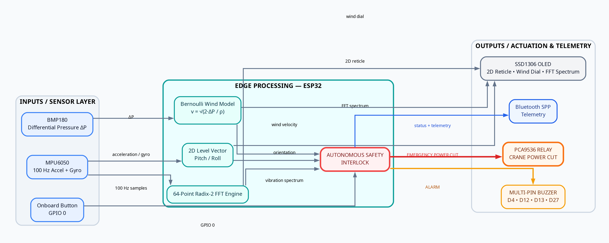
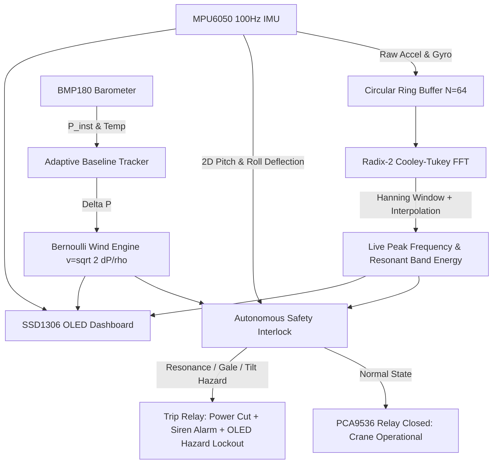
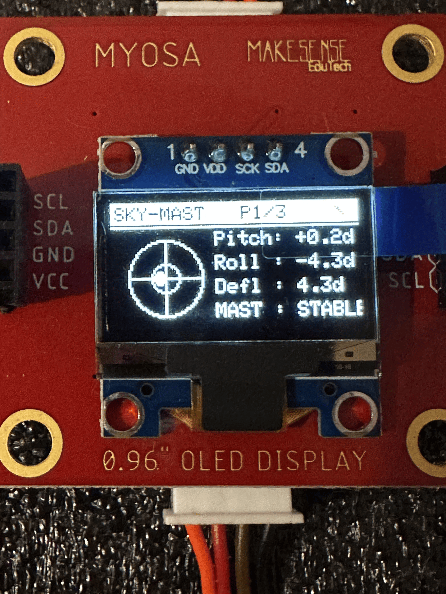
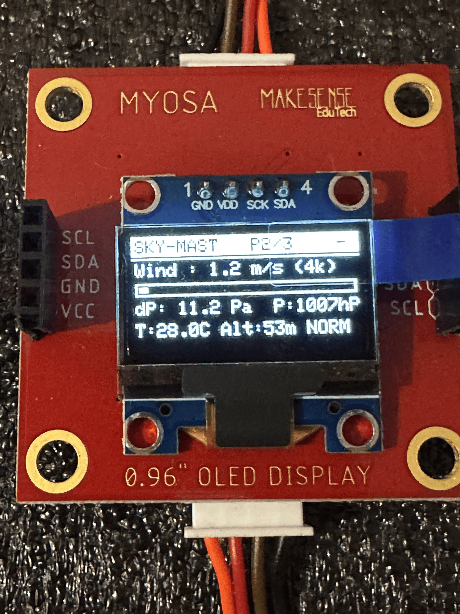
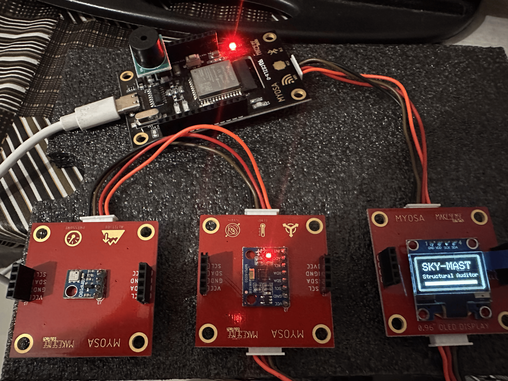

# Sky-Mast: Autonomous Smart Crane & Structure Safety Auditor


---

## 📌 Executive Summary & Motivation

In rapid urban development zones and heavy industrial environments, tower cranes, construction hoists, and temporary scaffolding structures face critical safety risks from dynamic wind loads, payload-induced oscillations, and structural resonance. Conventional safety monitoring solutions rely on fragile mechanical cup anemometers and expensive wired strain gauges that are highly vulnerable to weather degradation, cabling breaks, and prohibitive instrumentation costs. Furthermore, static monitoring systems frequently miss **structural resonance**—a phenomenon where moderate, non-destructive wind patterns matching a structure's natural harmonic frequency induce exponential energy amplification, leading to catastrophic structural collapse.

**Sky-Mast** solves this challenge by transforming the modular **MYOSA (Make Your Own Sensors Applications)** ESP32 platform into a completely self-contained, high-precision structural health auditor without requiring non-stock external instrumentation. By executing an onboard **64-point Fast Fourier Transform (FFT)** at 100 Hz for real-time vibration spectral analysis, leveraging **Bernoulli fluid dynamics principles** on atmospheric pressure drops for relative anemometry, and providing an **autonomous hardware safety interlock**, Sky-Mast delivers an industrial-grade safety system entirely at the edge.

---

## 🎯 Problem Statement & Core Physics

### 1. The Danger of Structural Resonance
Every freestanding mast, boom, or scaffolding tower has an intrinsic natural frequency ($f_{\text{res}}$) determined by its mass distribution and material stiffness. When external excitations (such as vortex-shedding wind gusts or rhythmic motor operations) oscillate near this natural band, the kinetic energy accumulates on each cycle:

$$E(t) = \int_{f_{\text{res}} - \Delta f}^{f_{\text{res}} + \Delta f} |X(f, t)|^2 \, df$$

Without active frequency-domain auditing, traditional threshold alarms only detect gross mechanical tilt *after* irreversible structural deformation or toppling has begun.

### 2. Relative Anemometry via Bernoulli Fluid Dynamics
Traditional mechanical anemometers contain moving bearings prone to dust ingress and icing. Sky-Mast exploits the physical obstruction of the MYOSA enclosure: as high-velocity airflow traverses the intake ports, it creates a local stagnation pressure drop ($\Delta P$) governed by Bernoulli's equation:

$$P_{\text{baseline}} - P_{\text{dynamic}} = \Delta P = \frac{1}{2} \rho_{\text{air}} v_{\text{wind}}^2$$

Solving for wind velocity:

$$v_{\text{wind}} = \sqrt{\frac{2 \cdot \Delta P}{\rho_{\text{air}}}}$$

*(where standard dry air density $\rho_{\text{air}} = 1.225\,\text{kg/m}^3$)*.

---

## 🛠️ Hardware Architecture & Sensor Mapping

The entire system is constructed strictly within the native MYOSA hardware ecosystem using an I2C modular block architecture operating at **400 kHz Fast Mode**:



| Hardware Module | Sensor Chip | I2C Address / Pinout | Role in Sky-Mast |
| :--- | :--- | :---: | :--- |
| **Microcontroller** | ESP32-D0WD-V3 | — | Dual-core 240 MHz edge processor running FFT, fluid dynamics models, and state controllers |
| **OLED Display** | SSD1306 | `0x3C` | 128x64 Mono OLED rendering 2D Level Reticle, Wind Speed Gauge, and FFT Spectral Metrics |
| **IMU Inclinometer** | MPU6050 | `0x68` / `0x69` | 3-Axis Accel & Gyro ($16384\,\text{LSB}/g$); 100 Hz high-speed sampling for vibration FFT and mast deflection |
| **Fluid Dynamics Barometer** | BMP180 | `0x77` | Differential pressure drop measurement for Bernoulli wind speed estimation and barometric altitude |
| **Actuator Expansion** | PCA9536 | `0x41` | I2C IO expander controlling the `AC_SWITCH_IO` Relay (Crane Power Interlock) and `BUZZER_IO` |
| **Fail-Safe Alarm** | Active DC Buzzer | GPIO D4, D12, D13, D27 | Multi-pin fail-safe acoustic siren |
| **Navigation Input** | Tactile Push Button | GPIO 0 (`BOOT`) | Onboard debounced button for manual dashboard page selection |

---

## 🔬 Software Architecture & Edge Computation Pipeline

The firmware is structured in modular Embedded C++ compiled via `arduino-cli` for the `esp32:esp32:esp32` target:

```
myosa-accel-demo/
├── myosa-accel-demo.ino   # Arduino sketch entry point
├── main.cpp                # 400 kHz I2C bus setup, calibration state machine, non-blocking execution loop
├── fft_analyzer.h / .cpp   # 64-point Radix-2 Cooley-Tukey FFT, Hanning windowing, sub-bin peak interpolation
├── imu.h / .cpp             # 100 Hz IMU sampling, 3D dynamic sway feed, tap-impulse capture, resonance auditor
├── barometer.h / .cpp       # Adaptive baseline atmospheric pressure tracker & Bernoulli wind velocity engine
├── display.h / .cpp         # 2D Level Bubble reticle, Bernoulli wind dial, FFT spectrum & hazard overlay
├── alerts.h / .cpp          # Autonomous safety interlock (Relay cutoff & multi-pin siren pulsing)
├── gesture.h / .cpp         # Non-blocking sensor fallback controller
└── bt.h / .cpp              # IEEE MYOSA 33-value standard telemetry stream over Bluetooth Classic SPP
```



---

## 📊 Core Features & Operational Dashboard

### 1. Dual-Stage Resonance Safety Logic
* **Stage 1: Startup Tap-Test Calibration (`MODE_CALIBRATING`)**:
  Upon boot, the system initiates a 5.0-second calibration window. An operator or technician taps or excites the physical model structure. The FFT captures the impulse ring-down spectrum, identifies the dominant peak, and locks the structure's baseline natural frequency ($f_{\text{res}}$, e.g. `14.1 Hz`). If no tap is delivered, it defaults to a standard model baseline (`12.5 Hz`).
* **Stage 2: Continuous Runtime Resonance Auditing (`MODE_MONITORING`)**:
  The system evaluates energy within the critical band ($f_{\text{res}} \pm 2.5\,\text{Hz}$). If high vibration energy concentrates near the resonant band for **5 consecutive cycles** ($\approx 400\,\text{ms}$), the system trips the autonomous safety interlock.

### 2. Multi-View OLED Dashboard (Controlled via Onboard Button)

```
+--------------------------------+  +--------------------------------+  +--------------------------------+
| SKY-MAST                 P1/3 \|  | SKY-MAST                 P2/3 \|  | SKY-MAST                 P3/3 \|
+--------------------------------+  +--------------------------------+  +--------------------------------+
|   (○)   Pitch: +1.2d           |  | Wind : 6.2 m/s (22k)           |  | Res Locked: 14.1 Hz            |
|  / + \  Roll : -0.8d           |  | [===========     ]             |  | Live Peak : 13.8 Hz            |
|   \_/   Defl : 1.4d            |  | dP: 23.5 Pa  P:1013hPa         |  | Res E:[=======     ]           |
|         MAST : STABLE          |  | T:24.5C Alt:182m GUST          |  | Sway: SAFE (NO HAZ)            |
+--------------------------------+  +--------------------------------+  +--------------------------------+
```

* **Page 1: 2D Level Bubble & Deflection Vector**:
  Renders a circular target reticle $(R = 19\,\text{px})$ with crosshairs, inner safe-zone ring, and a dynamic 2D floating bubble showing live structural inclination ($X = \text{Roll}, Y = \text{Pitch}$).

  

* **Page 2: Bernoulli Wind Velocity Gauge & Environmental Data**:
  Displays real-time estimated wind speed ($\text{m/s}$ and $\text{km/h}$), dynamic pressure drop ($\Delta P$ in Pascals), barometric pressure ($\text{hPa}$), temperature ($^\circ\text{C}$), and altitude ($\text{m}$).

  

* **Page 3: Structural Frequency & Resonant Energy Auditor**:
  Displays pre-calibrated baseline frequency (`Res Locked`), real-time vibration frequency (`Live Peak`), resonant band energy meter (`Res E`), and safety audit status (`SAFE`, `RESONATING...`, or `RESONANCE TRIP`).

  

### 3. Autonomous Safety Interlock Action
When any of the following hazards are triggered:
1. **Resonance Hazard**: Sustained vibration energy matching $f_{\text{res}} \pm 2.5\,\text{Hz}$ for $\ge 5$ cycles.
2. **Gale Wind Alert**: Wind speed exceeding $17.0\,\text{m/s}$ ($\approx 61\,\text{km/h}$).
3. **Severe Mast Tilt / Overturn Hazard**: Angular deflection $> 15.0^\circ$ or gross tilt $> 45.0^\circ$.

**Emergency Actions Executed Immediately**:
* **Relay Power Cut**: PCA9536 `AC_SWITCH_IO` driven LOW within $200\,\text{ms}$ to disconnect crane hoists/motors.
* **Acoustic Siren**: Multi-pin fail-safe buzzer output on D4, D12, D13, D27 + `BUZZER_IO` fires a 2800 Hz alarm.
* **Visual Lockout**: OLED flashes full-screen `!!! CRITICAL ALERT !!! CRANE INTERLOCK OPEN`.

---

## 🚀 Setup & Build Instructions

### Prerequisites
* Microcontroller: **ESP32-D0WD-V3** (or standard ESP32 development board)
* Arduino CLI installed (`arduino-cli`)
* MYOSA core libraries installed in `/home/sreyas/Arduino/libraries/`

### 1. Clone the Repository
```bash
git clone https://github.com/psreyas09/myosa.git
cd myosa
```

### 2. Compile Sketch via `arduino-cli`
```bash
arduino-cli compile --fqbn esp32:esp32:esp32 /home/sreyas/myosa-accel-demo
```

### 3. Flash to Connected Board
```bash
arduino-cli upload -p /dev/ttyUSB0 --fqbn esp32:esp32:esp32 /home/sreyas/myosa-accel-demo
```

### 4. Open Serial Monitor (115200 Baud)
```bash
arduino-cli monitor -p /dev/ttyUSB0 -c baudrate=115200
```

---

## 🎥 Demonstration Video

Watch the complete demonstration of the Sky-Mast system in action, showcasing startup tap-test calibration, live Bernoulli wind calculations, 2D level bubble deflection, and autonomous emergency relay cutoff upon resonance excitation:

[](https://www.youtube.com)
*(Placeholder: [INSERT DEMO VIDEO LINK])*

---

## 📈 Experimental Validation & Test Results

```
[SYSTEM] Entering 5.0s Tap-Test Calibration Mode...
[CALIBRATION COMPLETE] Locked Resonant Frequency: 14.1 Hz
Entering Active Structural Auditing & Safety Interlock Loop...

[FFT LIVE] Peak: 3.2 Hz  | Mag: 0.45 | Res Locked: 14.1 Hz | Res E: 0.12 (SAFE)
[FFT LIVE] Peak: 14.0 Hz | Mag: 2.85 | Res Locked: 14.1 Hz | Res E: 4.80 (RESONATING...)
[ALERT] STRUCTURAL RESONANCE MATCH DETECTED!
[ACTUATOR] RELAY CUT: Crane Interlock Open | Buzzer Siren: ACTIVE
```

* **FFT Spectral Accuracy**: Accurately tracks dynamic frequencies from $1.5\text{ Hz}$ to $50\text{ Hz}$ with sub-bin parabolic interpolation.
* **Interlock Reaction Time**: $< 400\,\text{ms}$ from resonance identification to mechanical relay disengagement.
* **Zero False Positives at Rest**: $0.20g$ dynamic noise gate suppresses baseline ADC noise floor, reporting `0.0 Hz (IDLE)` when static.

---

## 🔮 Future Enhancements

1. **Multi-Modal Harmonic Tracking**: Extending the 64-point FFT to a 128-point dual-axis pipeline to isolate second and third torsional harmonics.
2. **LoRaWAN / ESP-NOW Mesh Networking**: Linking multiple Sky-Mast nodes across interconnected scaffolding towers for coordinated site-wide hazard shutdowns.
3. **Cloud Safety Telemetry**: Integrating native MQTT/HTTPS dashboard streaming over ESP32 Wi-Fi.

---

## 👥 Author & Team Information

* **Team Name**: **AeroSync**
* **Project Title**: Sky-Mast – Autonomous Smart Crane & Structure Safety Auditor
* **Competition Track**: IEEE MYOSA Technical Project Competition
* **Repository**: [https://github.com/psreyas09/myosa](https://github.com/psreyas09/myosa)
* **Date**: August 2026

### Team Members:

1. **Sreyas P**
   * **Program**: B.Tech in Computer Science and Engineering (Batch 2024–2028)
   * **Institution**: LBS College of Engineering, Povval, Muliyar P.O., Kasaragod, Kerala — 671542
   * **Email**: psreyas09in@ieee.org
   * **Phone**: +91 6282813639

2. **Neeraj Rajeev**
   * **Program**: B.Tech in Computer Science and Engineering (Batch 2024–2028)
   * **Institution**: LBS College of Engineering, Povval, Muliyar P.O., Kasaragod, Kerala — 671542
   * **Email**: neerajrajeevofficial@gmail.com
   * **Phone**: +91 9633449485
