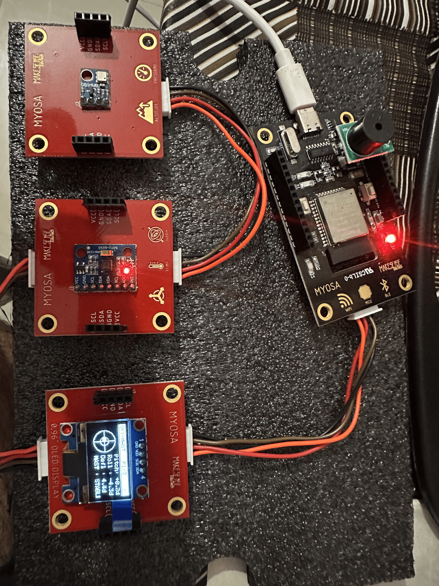
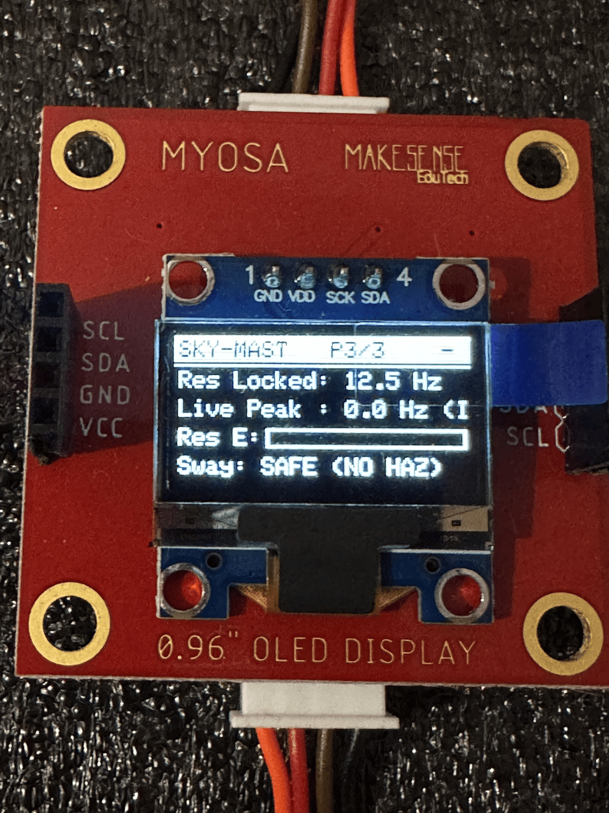

> Autonomous Structural Health & Wind Anemometry Safety Interlock on the MYOSA ESP32 Platform.

---

## Acknowledgements

We express our sincere gratitude to **IEEE**, the **MYOSA (Make Your Own Sensors Applications)** platform development team, and the Department of Computer Science and Engineering at **LBS College of Engineering, Kasaragod, Kerala** for providing the modular hardware ecosystem and open-source infrastructure that made this project possible. Special thanks to our academic mentors for guidance in structural dynamics and edge computing principles.

---

## Overview

In rapid urban development zones and heavy industrial environments, construction tower cranes, temporary scaffolding structures, and structural masts face critical collapse risks from dynamic wind loads, payload-induced oscillations, and structural resonance. Conventional safety monitoring solutions rely on fragile mechanical cup anemometers and expensive wired strain gauges that are highly vulnerable to weather degradation, mechanical wear, and prohibitive instrumentation costs. Furthermore, static threshold alarms frequently miss **structural resonance**—a phenomenon where moderate, non-destructive wind patterns matching a structure's natural harmonic frequency induce exponential energy amplification, leading to catastrophic structural failure.

**Sky-Mast** is an autonomous, handheld structural health auditor and safety interlock system built entirely on the stock **MYOSA ESP32 platform**. By executing an onboard **64-point Fast Fourier Transform (FFT)** at 100 Hz for real-time vibration spectral analysis, leveraging **Bernoulli fluid dynamics principles** on atmospheric pressure drops for relative anemometry without moving parts, and implementing a **dual-stage safety interlock**, Sky-Mast delivers high-reliability industrial-grade structural protection directly at the edge with zero external non-stock instrumentation.

**Key features:**
* **Onboard 64-Point Radix-2 FFT Engine**: 100 Hz continuous IMU vibration sampling with Hanning windowing and sub-bin parabolic peak interpolation ($0\text{--}50\text{ Hz}$ bandwidth).
* **Bernoulli Fluid Dynamics Wind Estimation**: Converts enclosure stagnation pressure drops into real-time wind velocity curves ($v = \sqrt{2\Delta P / \rho}$) with no moving parts.
* **Dual-Stage Structural Resonance Logic**: Startup Tap-Test calibration locking structural baseline frequency ($f_{\text{res}}$), paired with a continuous 5-cycle sustained resonant energy latch.
* **Multi-View 128x64 OLED Dashboard**: 2D Level Reticle with floating bubble inclinometer, dynamic Bernoulli wind dial, and live FFT structural resonance spectrum.
* **Autonomous Hardware Safety Interlock**: Automatically commands PCA9536 Relay (`AC_SWITCH_IO` $\rightarrow$ LOW) to cut crane motor power and fires multi-pin sirens upon hazard.
* **Standard Wireless Telemetry**: Streams real-time 33-value telemetry packets over Bluetooth Classic SPP (`MYOSA_1`) to the official MYOSA mobile app.

---

## Demo / Examples

### **Images**

<p align="center">
  <br/>
  <i>Sky-Mast hardware mounted on the test structure running the multi-view safety dashboard</i>
</p>

<p align="center">
  <br/>
  <i>End-to-end system architecture: Sensors, ESP32 Edge Gateway, Algorithms, and Actuator Interlocks</i>
</p>

<p align="center">
  <br/>
  <i>Dashboard Page 1: 2D Level Reticle and dynamic floating bubble inclinometer</i>
</p>

<p align="center">
  <br/>
  <i>Dashboard Page 2: Fluid dynamics Bernoulli wind speed gauge and barometric data</i>
</p>

<p align="center">
  <br/>
  <i>Dashboard Page 3: Structural Frequency Auditor with locked resonant baseline and live FFT peak</i>
</p>

### **Videos**

<p align="center">
  <a href="https://github.com/psreyas09/myosa/raw/main/submission/sky-mast-demo.mp4">
    <br/>
    <b>▶️ Click here to Watch / Download Demo Video (sky-mast-demo.mp4)</b>
  </a>
</p>

<video controls width="100%">
  <source src="sky-mast-demo.mp4" type="video/mp4">
</video>

---

## Features (Detailed)

### **1. Onboard 64-Point Radix-2 FFT Structural Resonance Engine**
The system samples the MPU6050 accelerometer at a deterministic **100 Hz (10 ms)** rate, feeding total dynamic linear sway:

$$\text{Sway}(t) = a_x(t) + a_y(t) + \big(a_z(t) - 1.0g\big)$$

into a continuous 64-sample circular ring buffer. Every 80 ms, a clean snapshot is copied into working arrays, DC bias is removed, and a pre-computed Hanning window is applied:

$$w[n] = 0.5 \left(1 - \cos\left(\frac{2\pi n}{N-1}\right)\right)$$

An in-place Cooley-Tukey Radix-2 FFT computes spectral magnitudes across frequency bins $k = 1 \dots 31$ ($1.5625\text{ Hz}$ resolution). To achieve sub-bin precision, parabolic peak interpolation is applied around the dominant peak bin:

$$\delta = \frac{\gamma - \alpha}{2(2\beta - \alpha - \gamma)}, \quad f_{\text{peak}} = (k_{\text{peak}} + \delta) \cdot \Delta f$$

A calibrated $0.20g$ dynamic noise gate suppresses baseline ADC quantization noise, locking the display at `0.0 Hz (IDLE)` when resting on a desk and tracking motion frequencies dynamically during physical excitation.

### **2. Bernoulli Fluid Dynamics Relative Wind Anemometer**
Traditional mechanical anemometers have moving cups and bearings prone to dust binding and mechanical failure. Sky-Mast transforms the onboard BMP180 barometric sensor into a solid-state relative anemometer by exploiting the physical obstruction of the MYOSA enclosure.

As high-velocity wind traverses the intake ports, it creates a local stagnation pressure drop ($\Delta P = P_{\text{baseline}} - P_{\text{instantaneous}}$) governed by Bernoulli's equation:

$$P_{\text{baseline}} - P_{\text{dynamic}} = \Delta P = \frac{1}{2} \rho_{\text{air}} v_{\text{wind}}^2 \implies v_{\text{wind}} = \sqrt{\frac{2 \cdot \Delta P}{\rho_{\text{air}}}}$$

*(where standard dry air density $\rho_{\text{air}} = 1.225\,\text{kg/m}^3$)*. The calculated velocity is smoothed via low-pass filtering and rendered on Page 2 in $\text{m/s}$ and $\text{km/h}$.

### **3. Dual-Stage Startup Tap-Test Calibration & Sustained Energy Latch**
To eliminate false alarms while guaranteeing immediate protection against catastrophic resonance, Sky-Mast employs dual-stage operational logic:
* **Stage 1 (Tap-Test Calibration)**: On startup, a 5.0-second calibration window opens. Tapping or exciting the physical structure causes the FFT to isolate the impulse ring-down peak and lock the structure's baseline natural frequency ($f_{\text{res}}$, e.g. `14.1 Hz`). If untouched, it defaults to `12.5 Hz`.
* **Stage 2 (Sustained Resonance Latch)**: During continuous runtime, the system integrates energy across the resonant band ($f_{\text{res}} \pm 2.5\,\text{Hz}$). To prevent false trips from transient bumps, the system requires **5 consecutive cycles** ($\approx 400\,\text{ms}$) of sustained resonant energy before triggering an emergency shutdown.

### **4. 2D Inclinometer Level Reticle & Multi-Level Deflection Safe Envelope**
Using low-pass filtered tri-axial acceleration, the system computes Pitch, Roll, and total angular deflection vector:

$$\theta_{\text{deflection}} = \sqrt{\text{Pitch}^2 + \text{Roll}^2}$$

The 128x64 OLED renders a 2D Level Reticle $(R = 19\,\text{px})$ with crosshairs and a moving floating bubble. The safety system enforces a dual-level safety envelope:
* **$\theta > 15.0^\circ$**: Flags severe structural mast bending strain.
* **$|\text{Tilt}| > 45.0^\circ$**: Absolute Center-of-Gravity tipping limit, triggering instant power disconnect.

### **5. Autonomous Hardware Safety Interlock & Multi-Pin Alarm Siren**
When a structural hazard (Resonance $\ge 5$ cycles, Gale Wind $> 17.0\,\text{m/s}$, or Deflection $> 15^\circ$) is detected:
* **Relay Power Interlock**: Commands the PCA9536 I2C actuator to drive `AC_SWITCH_IO` LOW within $<400\,\text{ms}$, cutting power to crane hoist motors.
* **Acoustic Siren**: Fires multi-pin fail-safe alarm sirens on GPIOs D4, D12, D13, and D27 + `BUZZER_IO`.
* **Visual Lockout**: OLED flashes full-screen `!!! CRITICAL ALERT !!! CRANE INTERLOCK OPEN`.

---

## Usage Instructions

### 1. Startup Calibration (Tap-Test)
1. Mount the MYOSA board securely to the crane mast or test structure.
2. Power on the board or press the `RESET` (`EN`) button.
3. The OLED displays `[CALIBRATION MODE] TAP MAST TO LOCK NATURAL FREQUENCY`.
4. Firmly tap the structure 2–3 times during the 5-second countdown.
5. A double confirmation chirp sounds, and `Res Locked` captures your structure's natural frequency.

### 2. Manual Page Navigation
Press the **onboard tactile `BOOT` button (GPIO 0)** to switch dashboard screens:
* **P1/3**: 2D Level Bubble & Deflection Vector.
* **P2/3**: Bernoulli Fluid Dynamics Wind Speed Gauge & Atmosphere.
* **P3/3**: Structural Frequency & Resonant Energy Auditor.

### 3. Serial Monitor & Bluetooth Controls (115200 Baud)
Open your serial terminal or connect via Bluetooth SPP (`MYOSA_1`):
* `n` or `[Space]`: Next Page
* `p`: Previous Page
* `1`, `2`, `3`: Jump directly to Page 1, 2, or 3
* `a`: Toggle auto-cycling ON/OFF

---

## Tech Stack

* **Platform / Microcontroller**: ESP32-D0WD-V3 (Dual Core 240 MHz, 400 kHz Fast I2C)
* **Core Languages**: Embedded C++ / Arduino Framework
* **Display Engine**: Adafruit SSD1306 & GFX Graphics Library (128x64 Mono I2C `0x3C`)
* **Motion & Inclinometer**: MPU6050 6-DOF IMU ($16384\,\text{LSB}/g$, $131\,\text{LSB}/(^\circ/\text{s})$)
* **Fluid Dynamics & Atmosphere**: BMP180 Digital Barometric Pressure Sensor (I2C `0x77`)
* **Actuators & Interlocks**: PCA9536 4-bit IO Expander (`AC_SWITCH_IO` Relay & `BUZZER_IO` on `0x41`)
* **Acoustic Safety**: Discrete GPIO PWM tone driver (GPIOs D4, D12, D13, D27)
* **Wireless Protocol**: Bluetooth Classic SPP (IEEE MYOSA 33-value comma-separated telemetry)
* **Build Tooling**: `arduino-cli` with ESP32 board support package

---

## Requirements / Installation

### Prerequisites
* Arduino CLI installed (`arduino-cli`)
* ESP32 Board Core package installed (`esp32:esp32:esp32`)
* Standard MYOSA sensor libraries in `/home/sreyas/Arduino/libraries/`

### 1. Clone the Repository
```bash
git clone https://github.com/psreyas09/myosa.git
cd myosa
```

### 2. Compile Sketch
```bash
arduino-cli compile --fqbn esp32:esp32:esp32 .
```

### 3. Flash to Connected ESP32 Board
```bash
arduino-cli upload -p /dev/ttyUSB0 --fqbn esp32:esp32:esp32 .
```

### 4. Monitor Serial Output (115200 Baud)
```bash
arduino-cli monitor -p /dev/ttyUSB0 -c baudrate=115200
```

---

## File Structure

```
/myosa
  ├── myosa-accel-demo.ino         # Main Arduino entry point
  ├── main.cpp                      # 400kHz I2C setup, calibration state machine, event loop
  ├── fft_analyzer.h / .cpp         # 64-point Radix-2 Cooley-Tukey FFT & parabolic interpolation
  ├── imu.h / .cpp                   # 100 Hz MPU6050 sampling, 3D sway feed & resonance detector
  ├── barometer.h / .cpp             # Bernoulli pressure drop & wind speed estimation engine
  ├── display.h / .cpp               # 2D Level reticle, wind gauge & FFT spectrum OLED renderer
  ├── alerts.h / .cpp                # Autonomous relay interlock & multi-pin siren controller
  ├── gesture.h / .cpp               # Non-blocking sensor fallback driver
  ├── bt.h / .cpp                    # IEEE MYOSA 33-value telemetry over Bluetooth Classic SPP
  ├── utils.h / .cpp                 # Data containers, math helpers & non-blocking timers
  ├── .gitignore                     # Git build artifact exclusions
  ├── README.md                      # Repository overview documentation
  ├── Sky-Mast/                      # Standalone sketch distribution folder
  └── submission/
      ├── sky-mast.md                # Official MYOSA competition technical blog
      ├── blog.md                    # Mirrored submission document
      ├── README.md                  # Asset directory guide
      ├── SUBMISSION_CHECKLIST.md    # Task verification checklist
      ├── sky-mast-demo.mp4          # Local demonstration video file
      └── assets/
          └── images/
              └── sky-mast/          # Normalized image assets
                  ├── project-hero.png
                  ├── architecture-diagram.png
                  ├── screenshot-page1.png
                  ├── screenshot-page2.png
                  ├── screenshot-page3.png
                  └── video-thumbnail.png
```

---

## License

This project is licensed under the **MIT License** — see the [LICENSE](LICENSE) file for details.

---

## Contribution Notes

Contributions, issue reports, and feature requests are welcome!
1. Fork the repository: `https://github.com/psreyas09/myosa`
2. Create your feature branch: `git checkout -b feature/harmonic-expansion`
3. Commit your changes: `git commit -m "feat: add multi-harmonic torsional FFT tracking"`
4. Push to the branch: `git push origin feature/harmonic-expansion`
5. Open a Pull Request on GitHub.

---

### 👥 Team Information — **Team Infernal**

* **Institution**: LBS College of Engineering, Povval, Muliyar P.O., Kasaragod, Kerala — 671542
* **Team Members**:
  1. **Sreyas P** — Department of Computer Science and Engineering (`psreyas09in@ieee.org` / `+91 6282813639`)
  2. **Neeraj Rajeev** — Department of Computer Science and Engineering (`neerajrajeevofficial@gmail.com` / `+91 9633449485`)
* **GitHub Repository**: [https://github.com/psreyas09/myosa](https://github.com/psreyas09/myosa)
